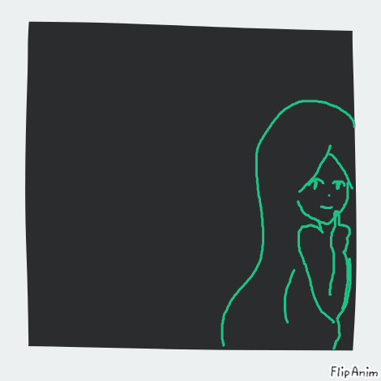
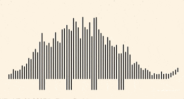

  
  

    
    
    
  

  

    (https://github.com/Taieta/github-readme-stats)
  <\div>

# Hell-o, I'm Lena 👋

🔭 I’m currently working on [my profile readme.md](https://github.com/Taieta/Taieta)

🌱 I’m currently learning               

📫 Write me:       <-   icons are [clickable](https://github.com/Taieta)

⚡ Fun fact: I like alternative metal 

